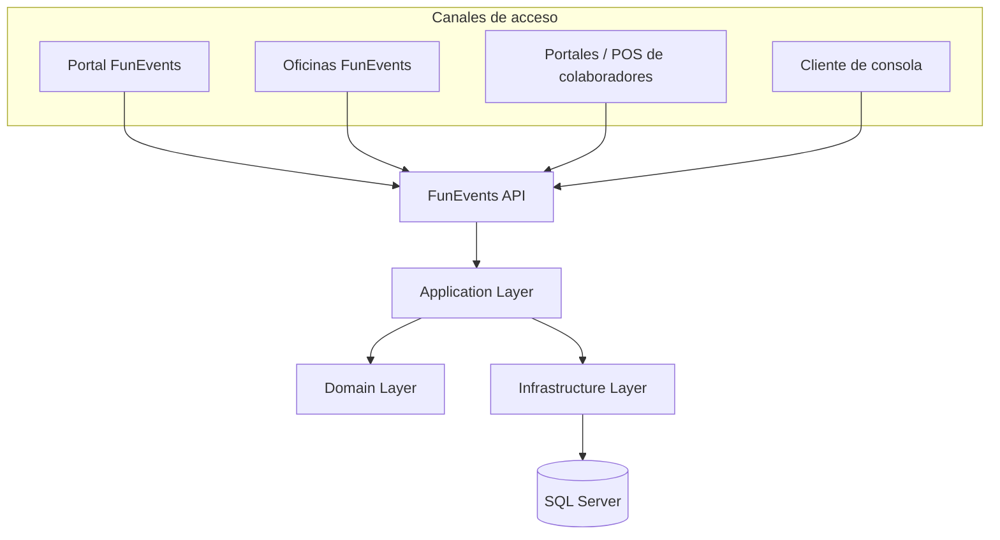

# FunEvents - Arquitectura del Sistema

## 1. Contexto y objetivo

FunEvents es una empresa dedicada a la organización de eventos de entretenimiento, como conciertos y obras de teatro, que requiere una plataforma centralizada para gestionar la disponibilidad y reserva de entradas a través de diferentes canales de venta.

El sistema debe soportar principalmente la venta online a través del portal de FunEvents, pero también debe permitir que las oficinas de atención al cliente y los colaboradores externos puedan realizar operaciones sobre el mismo inventario de entradas.

Los colaboradores pueden disponer de sus propios portales web o aplicaciones de punto de venta, por lo que la solución debe proporcionar mecanismos de integración que les permitan ofrecer una experiencia de compra propia sin duplicar la lógica de negocio de FunEvents.

Para el prototipo se propone una arquitectura **API-first y modular**, implementada inicialmente como un **monolito modular**. Esta aproximación permite mantener una solución sencilla de desarrollar y operar, manteniendo una separación clara de responsabilidades y dejando preparada la arquitectura para evolucionar posteriormente hacia componentes independientes cuando existan necesidades reales de escalabilidad o desacoplamiento.

El objetivo del prototipo es demostrar el flujo principal de reserva de entradas mediante un cliente de consola que consume la API web de FunEvents.

---

## 2. Requerimientos arquitectónicos

A partir del escenario planteado, se identifican los siguientes requerimientos.

### 2.1 Requerimientos funcionales

* Gestionar eventos de entretenimiento.
* Identificar usuarios mediante un código conocido.
* Identificar eventos mediante un código conocido.
* Gestionar la disponibilidad de entradas para cada evento.
* Permitir realizar reservas indicando la cantidad de entradas solicitadas.
* Permitir que las reservas sean realizadas desde diferentes canales.
* Exponer una API que pueda ser consumida por aplicaciones externas.
* Permitir la integración de portales y sistemas de punto de venta de colaboradores.

### 2.2 Requerimientos no funcionales

#### Integración

La solución debe proporcionar una interfaz de integración basada en API para que los diferentes canales puedan utilizar las capacidades de FunEvents sin acceder directamente a la base de datos.

#### Seguridad

Los clientes externos deben ser autenticados y autorizados antes de acceder a las operaciones protegidas. En una implementación productiva se contempla el uso de estándares como OAuth 2.0 y OpenID Connect para la integración con aplicaciones de terceros.

Para el prototipo se mantiene este aspecto simplificado, dado que el objetivo principal de la prueba es demostrar el flujo de reserva.

#### Consistencia del inventario

El sistema debe evitar que una reserva consuma más entradas de las disponibles, incluso cuando existan solicitudes concurrentes.

#### Mantenibilidad

La lógica de negocio debe mantenerse separada de la exposición HTTP y de los mecanismos de persistencia, permitiendo modificar una capa sin introducir acoplamiento innecesario en las demás.

#### Escalabilidad

La solución debe permitir crecer progresivamente en capacidad sin introducir desde el inicio una complejidad operacional innecesaria.

#### Trazabilidad

Las operaciones relevantes, especialmente las reservas, deben poder ser registradas para facilitar diagnóstico, seguimiento y auditoría.

---

## 3. Arquitectura propuesta

### 3.1 Enfoque arquitectónico

Se propone una arquitectura **API-first con un monolito modular**.

Todos los canales interactúan con FunEvents mediante una API centralizada. La lógica de negocio se mantiene dentro de la aplicación y no se replica en cada canal.

La solución se divide conceptualmente en las siguientes capas:

* **API:** exposición de endpoints HTTP y contratos de entrada y salida.
* **Application:** implementación de casos de uso y coordinación de las operaciones de negocio.
* **Domain:** entidades y reglas fundamentales del dominio.
* **Infrastructure:** persistencia, acceso a datos y componentes técnicos externos.
* **Database:** almacenamiento persistente mediante SQL Server.

El prototipo se implementará utilizando **.NET 8, ASP.NET Core Minimal APIs, C#, Entity Framework Core y SQL Server**.

### 3.2 Diagrama general



Los diferentes canales utilizan la misma API y, por tanto, comparten las mismas reglas de negocio y mecanismos de control de disponibilidad.

Ningún canal accede directamente a SQL Server.

### 3.3 Capas de la aplicación

#### API

Responsable de exponer las funcionalidades del sistema mediante HTTP.

Sus responsabilidades principales son:

* Definir endpoints.
* Validar la estructura de las solicitudes.
* Gestionar códigos de respuesta HTTP.
* Serializar y deserializar los contratos.
* Aplicar autenticación y autorización en los endpoints correspondientes.
* Registrar información relevante de las solicitudes.

La API no debe contener directamente las reglas principales del negocio.

#### Application

Contiene los casos de uso del sistema.

Para el prototipo se contempla principalmente el caso de uso de creación de una reserva.

Sus responsabilidades incluyen:

* Coordinar la creación de reservas.
* Consultar usuarios y eventos.
* Validar reglas de negocio.
* Solicitar la actualización del inventario.
* Persistir la reserva.
* Gestionar la transacción correspondiente.

Esta capa permite que la misma lógica pueda ser utilizada independientemente del canal que origine la operación.

#### Domain

Contiene los conceptos principales del negocio y sus reglas.

Para el prototipo se consideran principalmente:

* `User`
* `Event`
* `Reservation`

El inventario se maneja inicialmente de forma agregada mediante la cantidad de entradas disponibles en cada evento.

La arquitectura no depende de este modelo simplificado, por lo que posteriormente podría evolucionarse hacia un inventario individual de entradas, localidades o asientos.

#### Infrastructure

Contiene los detalles técnicos necesarios para ejecutar los casos de uso, incluyendo:

* Entity Framework Core.
* SQL Server.
* Configuración de persistencia.
* Implementaciones de acceso a datos.
* Integraciones con servicios externos que puedan incorporarse posteriormente.

Esta separación evita que el dominio y los casos de uso dependan directamente de detalles específicos de la base de datos.

### 3.4 Canales de acceso

La arquitectura contempla inicialmente los siguientes canales:

| Canal              | Descripción                                                           |
| ------------------ | --------------------------------------------------------------------- |
| Portal FunEvents   | Canal principal de venta online                                       |
| Oficinas           | Aplicaciones utilizadas por los puntos de atención de FunEvents       |
| Partners           | Portales y sistemas POS de colaboradores externos                     |
| Cliente de consola | Cliente utilizado exclusivamente para demostrar y probar el prototipo |

Todos ellos consumen la misma API.

Esto permite centralizar las reglas de negocio y evita que cada canal tenga que implementar por separado procesos como validación de disponibilidad, creación de reservas o control de inventario.

---

## 4. Componentes principales

### 4.1 FunEvents API

Es el punto de entrada de las operaciones del sistema.

En el prototipo se expondrán las operaciones necesarias para demostrar el flujo de reserva, incluyendo la identificación de eventos y usuarios y la creación de una reserva.

La API estará diseñada siguiendo principios REST y utilizará códigos HTTP apropiados para representar el resultado de las operaciones.

### 4.2 Reservation Application Service

Representa el caso de uso principal del prototipo: la creación de una reserva.

El flujo general será:

1. Recibir el código del evento, código del usuario y cantidad solicitada.
2. Validar los datos de entrada.
3. Obtener el usuario.
4. Obtener el evento.
5. Verificar que el evento permita reservas.
6. Verificar que exista disponibilidad suficiente.
7. Actualizar el inventario disponible.
8. Crear la reserva.
9. Confirmar la transacción.
10. Devolver el resultado al cliente.

El control de disponibilidad se realizará de manera transaccional para evitar que solicitudes concurrentes puedan reservar más entradas de las existentes.

### 4.3 Event

Representa un evento de entretenimiento.

Para el prototipo se manejará un inventario agregado, por ejemplo:

```text
Event
-------------------------
Code
Name
EventDate
TotalCapacity
AvailableTickets
Status
```

La cantidad de entradas solicitadas en una reserva estará limitada inicialmente a un rango de **1 a 99 entradas**.

### 4.4 User

Representa al usuario que realiza una reserva.

Se identificará mediante un código conocido, de acuerdo con el escenario de la prueba.

```text
User
-------------------------
Code
Name
Email
CreatedAt
```

### 4.5 Reservation

Representa la reserva realizada por un usuario para un evento.

```text
Reservation
-------------------------
ReservationCode
UserId
EventId
Quantity
Channel
Status
CreatedAt
```

La reserva registra también el canal desde el cual se originó la operación, permitiendo diferenciar posteriormente las reservas realizadas online, desde oficinas o mediante colaboradores.

### 4.6 SQL Server

SQL Server será utilizado como mecanismo de persistencia del prototipo.

La base de datos almacenará los usuarios, eventos y reservas, manteniendo las relaciones entre ellos y las restricciones necesarias para garantizar la integridad de los datos.

El acceso a la base de datos estará encapsulado en la capa de infraestructura y no será accesible directamente desde los canales externos.
